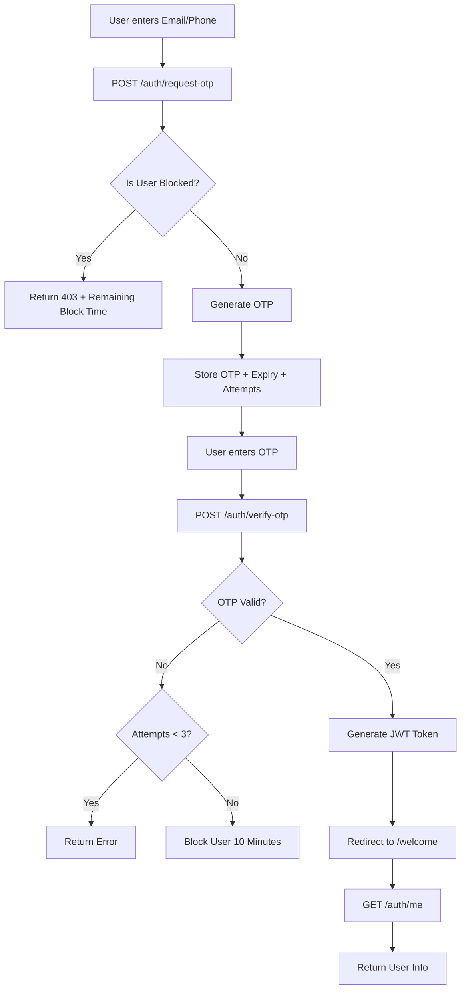

# 🔐 OTP Authentication Fullstack Application

A minimal fullstack OTP-based authentication system built using **React (Vite)** and **Node.js (Express)**.

This project demonstrates secure OTP validation, attempt limiting, blocking logic, JWT authentication, protected routes, and modern UI/UX.

---

## 🚀 Tech Stack

### Frontend
- React (Vite)
- React Router DOM
- Axios
- Custom CSS Styling
- LocalStorage (Session Persistence)

### Backend
- Node.js
- Express.js
- JSON Web Token (JWT)
- In-memory OTP store (Map)

---

# 🏗 Architecture Overview

- React frontend communicates with Express backend via REST APIs.
- OTPs are generated server-side and stored temporarily in memory.
- Backend enforces:
  - OTP expiration (5 minutes)
  - Maximum 3 attempts
  - 10-minute block after failed attempts
- JWT token issued on successful verification.
- Protected routes validate JWT on every request.
- Block logic enforced strictly on backend (not frontend).

---

# 🔄 Authentication Flow

🔐 Security Features

OTP expires in 5 minutes
Maximum 3 invalid attempts
User blocked for 10 minutes after 3 failures
Block time displayed as live countdown (MM:SS)
Backend-enforced blocking
JWT protected routes
Logout clears token + browser history
Identifier masking (email/phone)
Resend disabled while blocked
Loading spinner during API calls

🧠 Assumptions

Users are auto-created (no database required)
OTP delivery is mocked (console log)
In-memory store used for simplicity
Data resets if backend restarts
JWT stored in localStorage
No rate limiting implemented (out of scope)

📁 Project Structure
otp-auth-app
│
├── backend
│   ├── routes
│   ├── utils
│   ├── server.js
│   └── package.json
│
├── frontend
│   ├── src
│   │   ├── pages
│   │   ├── api.js
│   │   ├── main.jsx
│   │   └── styles.css
│   └── package.json
│
└── README.md

⚙️ How to Run Locally
1️⃣ Clone Repository
git clone https://github.com/Kryptonnnnnn/otp-auth-app.git
cd otp-auth-app

2️⃣ Start Backend
cd backend
npm install
node server.js

Backend runs on:
http://localhost:5000

3️⃣ Start Frontend

Open a new terminal:

cd frontend
npm install
npm run dev

Frontend runs on:
http://localhost:5173

🧪 Test Flow

Enter valid email or 10-digit phone
Check backend console for OTP
Enter OTP
Test invalid OTP 3 times → user blocked
Refresh page → block persists
Wait countdown → access restored
Logout → token cleared
Back button does not restore protected routes

📡 API Endpoints

1️⃣ Request OTP
POST /auth/request-otp
Body:
{
  "identifier": "email_or_phone"
}

2️⃣ Verify OTP
POST /auth/verify-otp

Body:
{
  "identifier": "email_or_phone",
  "otp": "123456"
}

3️⃣ Get Authenticated User
GET /auth/me

Headers:
Authorization: Bearer <JWT_TOKEN>

🎯 What This Project Demonstrates

Clean backend architecture
Secure OTP validation logic
Backend-driven security enforcement
JWT authentication
Route protection
UX improvements (countdown, masking, spinner)
Proper session management
Clean documentation
